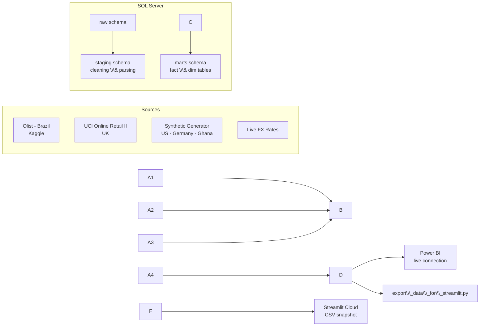

<div align="center">

MERIDIAN — Global Commerce Intelligence
Internal analytics platform, Data & Analytics Engineering


→ View the live dashboard · → Full build log
</div>
---
> \\\*\\\*A note on framing:\\\*\\\* this project models Richard's work as a Data \\\&
> Analytics Engineer at \\\*\\\*Latitude Retail Co.\\\*\\\*, a fictional e-commerce
> company used purely as a narrative device. No such company exists — the
> business problem, the data, and the technical build are all real; only
> the employer is invented, and it's disclosed as such here rather than
> left for someone to assume.
Table of Contents
Business Context
Northstar Metrics
Executive Summary
Insights Deep-Dive
Dataset Structure
Architecture
Tech Stack
Data Sources
Repository Structure
Getting Started
Dashboards & Sample Insights
Data Transparency & Known Limitations
---
Business Context
Role: Data & Analytics Engineer, reporting to the Head of Operations at
Latitude Retail Co.
Latitude Retail Co. operates in two established markets — Brazil and
the UK — with years of transaction history, and has recently expanded
into three newer markets: the US, Germany, and Ghana.
Leadership wants a single, unified view of performance across all five
regions to guide the next phase of expansion.
That request creates a real tension: the newer markets don't yet have
comparable data depth to the established ones, but a dashboard that treats
all five regions as equally mature risks leading leadership to the wrong
conclusion — reading a data gap as a performance failure.
MERIDIAN — the platform built to answer that brief — combines two
deliberately different data-engineering challenges, rather than treating
synthetic data as a stand-in for something missing:
Brazil and the UK run on real, messy, publicly available transaction
data. This is where the ELT cleaning, staging logic, and the data-quality
investigation documented below actually happened.
The US, Germany, and Ghana run on a calibrated synthetic dataset,
built to demonstrate a second, equally real skill: producing
production-realistic data for a market that doesn't have transaction
history yet — a genuine, common need before a new market's data warehouse
exists.
Both halves are disclosed openly throughout the reporting, rather than
blended into a single undifferentiated total.
At current scale, the dataset spans:
Metric	Value
Total orders	159,114
Total customers	103,130
Tracked revenue	~$32M USD ($31.7M real · $361K synthetic)
Regions covered	5
Time span	2009–2025 (varies by region)
Northstar Metrics
The analysis is organized around five focus areas:
Sales trends — revenue, order volume, and average order value, tracked across regions and normalized to USD
Customer segmentation (RFM) — identifying loyal, at-risk, new, and lost customers to inform retention strategy
Logistics performance — delivery time by region and its relationship to customer review scores
Demand forecasting — projected order volume for the next quarter, by region
Anomaly detection — automated flagging of irregular orders for review

Executive Summary
<div align="center">

</div>
Key findings:
Revenue is concentrated in the two established markets — the UK and
Brazil account for the large majority of tracked revenue — but this
reflects order volume, not underperformance in the newer markets.
Average order value is actually comparable across all five regions
($26–$80 USD). See the Insights Deep-Dive below
for the full investigation.
Refund rates vary meaningfully by region (1.7%–25.2%), warranting
region-specific follow-up rather than a single blended target.
Delivery performance correlates with review scores — orders
delivered in 0–10 days average a ~4.3 review score; orders taking 20+
days drop to ~3.1.
Customer segmentation (RFM) shows Loyal Customers as the largest
single segment (~33K), with a meaningful At-Risk and Lost population
worth targeted retention effort.
Insights Deep-Dive
Revenue by Region: a sample-size story, not a performance one
The signal. Partway through the build, the revenue-by-region chart
showed the US, Germany, and Ghana at close to zero next to Brazil and the
UK — the kind of pattern that, read at face value, would suggest the
expansion into those three markets was failing.
The investigation. Rather than take the chart at face value, a
diagnostic query grouped orders by region, source system, and currency,
comparing order count against average and total order value in both local
currency and USD. This immediately ruled out a currency-conversion bug —
average order value was reasonable and broadly comparable across all five
regions ($26–$80 USD). The real driver was order volume: the two
established regions had 50,000–99,000 orders each, versus ~2,000 each for
the three newer markets — a scale gap large enough to make the newer
markets disappear next to the established ones on any totals chart,
independent of how each individual order performed.
A related finding, checked rather than assumed. The UK data also
contained one striking outlier — a single ~$230,000 order. Rather than
treat it as a data error, the top 20 UK orders by value were pulled
directly; the outlier turned out to be paired with an identical negative
value a few minutes later, under the same customer, matching the source
dataset's own documented cancellation convention. Legitimate, not a bug —
confirmed with data rather than assumed away.
The fix. Rather than artificially inflating synthetic order volume to
make the chart "look balanced," the decision was to disclose the gap
directly: an average-order-value view alongside the totals (for a fair
per-region comparison regardless of sample size), plus an explicit note on
the volume difference in both dashboards. A separate, smaller data-quality
issue found during the same investigation — six UK records that were bank
adjustment entries, not real orders — was excluded at the source in the
staging layer.
Full diagnostic queries, SQL fixes, and verification steps are documented
in `PROJECT\\\_LOG.md`.
Dataset Structure
```mermaid
erDiagram
    DIM\\\_CUSTOMERS ||--o{ FCT\\\_ORDERS : places
    FCT\\\_ORDERS {
        string order\\\_id PK
        string customer\\\_id FK
        string region
        string currency\\\_code
        float amount\\\_local
        float amount\\\_usd
        string product\\\_category
        date order\\\_date
        date delivered\\\_date
        bit is\\\_refunded
        date refund\\\_date
        int review\\\_score
        string order\\\_status
        string source\\\_system
    }
```
`fct\\\_orders` is the core fact table all reporting reads from. Full schema
for `dim\\\_customers` and the reporting-layer views is in
`sql\\\_server\\\_project/Phase 3/`.
Architecture

Power BI connects live to the marts layer. Streamlit Cloud has no network path to a local SQL Server instance, so it reads from a versioned CSV snapshot instead — a deliberate design decision, not a shortcut (see `streamlit/README\\\_STREAMLIT.md`).
Tech Stack
Layer	Tools
Data sourcing	Kaggle (Olist), UCI Machine Learning Repository, Python (synthetic generation)
Database	Microsoft SQL Server, SSMS
Pipeline / ELT	T-SQL views, Python (pandas, pyodbc, SQLAlchemy)
Analysis	Jupyter, pandas, RFM/cohort/forecasting notebooks
Dashboards	Power BI (live), Streamlit + Plotly (public deployment)
Deployment	Streamlit Community Cloud, GitHub
Data Sources
Region	Source	Type	Order Volume
🇧🇷 Brazil	Olist Brazilian E-Commerce (Kaggle)	Real	~99,000
🇬🇧 UK	UCI Online Retail II	Real	~53,600
🇺🇸 US	Calibrated synthetic generator	Synthetic	~2,000
🇩🇪 Germany	Calibrated synthetic generator	Synthetic	~2,000
🇬🇭 Ghana	Calibrated synthetic generator	Synthetic	~2,000
The order-volume gap between real and synthetic regions is intentional and disclosed directly in both dashboards — see Data Transparency below.
Repository Structure
```
meridian/
├── assets/                    # Logo and README images
├── data\\\_generation/          # Synthetic data generator, FX rate fetcher
├── sql\\\_server\\\_project/
│   ├── Phase 3/               # raw → staging → marts SQL
│   └── Dashboard/             # Power BI-facing reporting views
├── Analysis/                  # Jupyter notebooks (7 phases of analysis)
├── streamlit/
│   ├── app.py                 # Live dashboard
│   ├── export\\\_data\\\_for\\\_streamlit.py
│   └── data/                  # CSV snapshots powering the live app
└── PROJECT\\\_LOG.md             # Full build history, bugs, and fixes
```
Getting Started
To run this locally, you'll need SQL Server and Python installed.
```bash
git clone https://github.com/Richardsante1/meridian.git
cd meridian
```
Run the SQL scripts in `sql\\\_server\\\_project/` in order (`01\\\_create\\\_database.sql` through the Phase 3 subfolders) to build the raw → staging → marts pipeline
Run `data\\\_generation/generate\\\_synthetic\\\_data.py` to produce the US, Germany, and Ghana datasets, and `fetch\\\_exchange\\\_rates.py` for current FX rates
Load the raw data with `sql\\\_server\\\_project/03\\\_load\\\_raw\\\_data.py`
Explore the analysis notebooks in `Analysis/`
To run the dashboard locally:
```bash
   pip install -r streamlit/requirements.txt
   python -m streamlit run streamlit/app.py
   ```
Dashboards & Sample Insights
<table>
<tr>
<td></td>
<td></td>
</tr>
<tr>
<td></td>
<td></td>
</tr>
</table>
More visuals — demand forecasting, refund rates, marketing attribution, and anomaly flagging — are available in `Analysis/` and in the live dashboard.
Data Transparency & Known Limitations
This project treats honest disclosure as part of the deliverable, not an afterthought:
Real vs. synthetic sample sizes differ substantially (see table above). Both dashboards surface this directly, and average-order-value visuals are provided alongside raw totals so regions can be compared fairly regardless of volume.
Marketing attribution data is illustrative only — it's built and functional, but its underlying spend figures have no real-world grounding, so it's intentionally excluded from the main dashboards.
Every bug found during the build — and how it was diagnosed and fixed — is documented in `PROJECT\\\_LOG.md`, including a full diagnostic query appendix for anyone who wants to reproduce the checks themselves.
---
<div align="center">
Built by Richard Asante as a portfolio data engineering project.
</div>