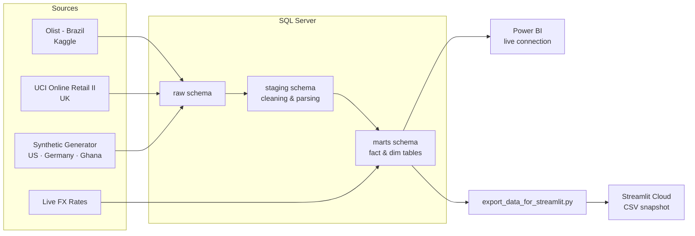
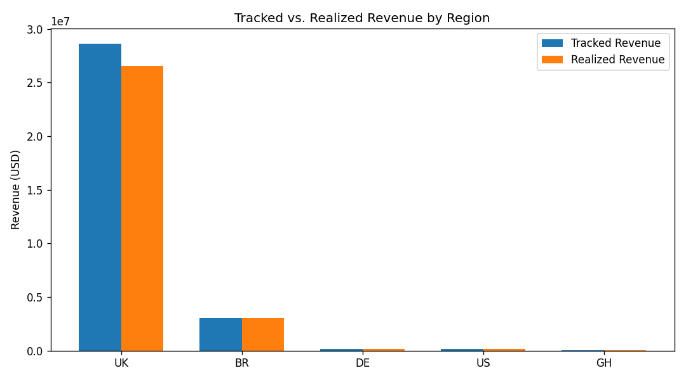
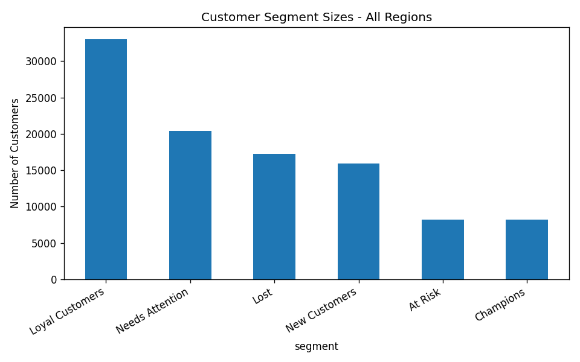
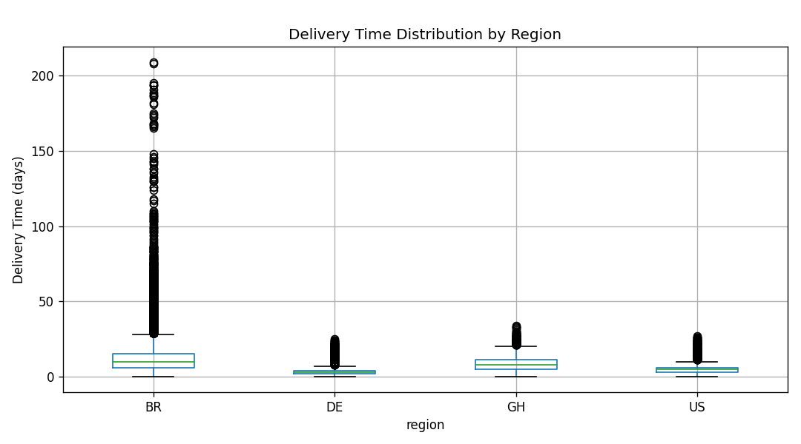
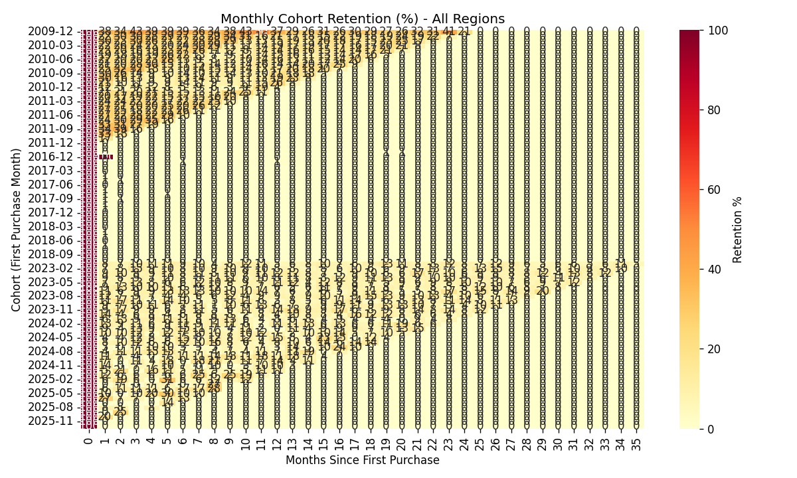

# MERIDIAN — Global Commerce Intelligence

**A multi-region e-commerce analytics platform, built end-to-end** — real-world datasets, calibrated synthetic data, a SQL Server ELT pipeline, and dual delivery through Power BI and a live public dashboard.

[](https://meridian-ed8vjruy3zxytbr4buwv2v.streamlit.app)

**[→ View the live dashboard](https://meridian-ed8vjruy3zxytbr4buwv2v.streamlit.app)**

---

## Overview

MERIDIAN is a portfolio data engineering project that simulates a real analytics function for a global e-commerce company operating across five regions: **Brazil, the UK, the US, Germany, and Ghana.**

Two of those regions run on genuine, publicly available transaction data. The other three are built from a calibrated synthetic data generator, designed to be statistically plausible rather than arbitrary — same approach a data team would take when expanding into a market before a full data warehouse exists there.

The project covers the full pipeline a data engineer or analytics engineer would actually own: ingesting raw data, cleaning and modeling it through a proper ELT layer, normalizing currencies with live FX rates, and delivering the result through two independent reporting layers.

## Key Features

- **Five-region, currency-normalized reporting** — all revenue figures converted to USD using fetched exchange rates, not hardcoded conversions
- **Real + synthetic data, clearly separated** — no attempt to disguise which regions are real; the dashboards actively disclose this
- **Full ELT pipeline in SQL Server** — raw → staging → marts, with staging responsible for cleaning messy source data (inconsistent dates, cancellation conventions, non-order records) so marts stays clean
- **Seven analysis notebooks** covering revenue, cohort retention, RFM segmentation, logistics/delivery performance, marketing attribution, demand forecasting, and anomaly detection
- **Two independent BI layers** — a live-connected Power BI report and a publicly deployed Streamlit dashboard, so the same verified numbers are explorable two different ways
- **A documented debugging history** — every real bug hit during the build (and how it was found and fixed) is logged in [`PROJECT_LOG.md`](./PROJECT_LOG.md), rather than only showing the finished result

## Architecture



Power BI connects live to the marts layer. Streamlit Cloud has no network path to a local SQL Server instance, so it reads from a versioned CSV snapshot instead — a deliberate design decision, not a shortcut (see [`streamlit/README_STREAMLIT.md`](./streamlit/README_STREAMLIT.md)).

## Tech Stack

| Layer | Tools |
|---|---|
| Data sourcing | Kaggle (Olist), UCI Machine Learning Repository, Python (synthetic generation) |
| Database | Microsoft SQL Server, SSMS |
| Pipeline / ELT | T-SQL views, Python (pandas, pyodbc, SQLAlchemy) |
| Analysis | Jupyter, pandas, RFM/cohort/forecasting notebooks |
| Dashboards | Power BI (live), Streamlit + Plotly (public deployment) |
| Deployment | Streamlit Community Cloud, GitHub |

## Data Sources

| Region | Source | Type | Order Volume |
|---|---|---|---|
| 🇧🇷 Brazil | Olist Brazilian E-Commerce (Kaggle) | Real | ~99,000 |
| 🇬🇧 UK | UCI Online Retail II | Real | ~53,600 |
| 🇺🇸 US | Calibrated synthetic generator | Synthetic | ~2,000 |
| 🇩🇪 Germany | Calibrated synthetic generator | Synthetic | ~2,000 |
| 🇬🇭 Ghana | Calibrated synthetic generator | Synthetic | ~2,000 |

The order-volume gap between real and synthetic regions is intentional and disclosed directly in both dashboards — see [Data Transparency](#data-transparency--known-limitations) below.

## Repository Structure

```
meridian/
├── data_generation/          # Synthetic data generator, FX rate fetcher
├── sql_server_project/
│   ├── Phase 3/               # raw → staging → marts SQL
│   └── Dashboard/             # Power BI-facing reporting views
├── Analysis/                  # Jupyter notebooks (7 phases of analysis)
├── streamlit/
│   ├── app.py                 # Live dashboard
│   ├── export_data_for_streamlit.py
│   └── data/                  # CSV snapshots powering the live app
└── PROJECT_LOG.md             # Full build history, bugs, and fixes
```

## Getting Started

To run this locally, you'll need SQL Server and Python installed.

```bash
git clone https://github.com/Richardsante1/meridian.git
cd meridian
```

1. Run the SQL scripts in `sql_server_project/` in order (`01_create_database.sql` through the Phase 3 subfolders) to build the raw → staging → marts pipeline
2. Run `data_generation/generate_synthetic_data.py` to produce the US, Germany, and Ghana datasets, and `fetch_exchange_rates.py` for current FX rates
3. Load the raw data with `sql_server_project/03_load_raw_data.py`
4. Explore the analysis notebooks in `Analysis/`
5. To run the dashboard locally:
   ```bash
   pip install -r streamlit/requirements.txt
   streamlit run streamlit/app.py
   ```

## Dashboards & Sample Insights

<table>
<tr>
<td></td>
<td></td>
</tr>
<tr>
<td></td>
<td></td>
</tr>
</table>

More visuals — demand forecasting, refund rates, marketing attribution, and anomaly flagging — are available in `Analysis/` and in the [live dashboard](https://meridian-ed8vjruy3zxytbr4buwv2v.streamlit.app).

## Data Transparency & Known Limitations

This project treats honest disclosure as part of the deliverable, not an afterthought:

- **Real vs. synthetic sample sizes differ substantially** (see table above). Both dashboards surface this directly, and average-order-value visuals are provided alongside raw totals so regions can be compared fairly regardless of volume.
- **Marketing attribution data is illustrative only** — it's built and functional, but its underlying spend figures have no real-world grounding, so it's intentionally excluded from the main dashboards.
- **Every bug found during the build — and how it was diagnosed and fixed — is documented in [`PROJECT_LOG.md`](./PROJECT_LOG.md)**, including a full diagnostic query appendix for anyone who wants to reproduce the checks themselves.

## Author

Built by [Richard Asante](https://github.com/Richardsante1) as a portfolio data project.
